# Pose2Carton 

EE228 课程大作业，利用3D骨架控制3D卡通人物。

# Maya 环境配置
从官网下载安装maya
  
  1）在官网：https://www.autodesk.com.cn/products/maya/overview 申请autodesk账户，并申请教育版权限。
  
  2）通过maya2020安装包的链接，安装maya2020。
  
  3）安装完成后，运行maya2020

安装pip与numpy
  
  1)	将maya2020安装目录下bin文件夹路径添加到系统环境变量。
  
  2)	能在cmd中运行mayapy即可。
  
  3)	安装pip
      
      打开maya，打开cmd，输入：
      
      curl https://bootstrap.pypa.io/pip/2.7/get-pip.py -o get-pip.py
      mayapy get-pip.py
  
  4)  安装numpy
      
      在cmd中运行：
      
      mayapy -m pip install -i https://pypi.anaconda.org/carlkl/simple numpy

在mayapy中import库检查是否能够运行

在cmd中运行 mayapy fbx_parser.py xxxx.fbx ，运行成功即可

# 匹配流程
主要代码使用的流程是transfer_one_sequence -> transfer_given_posetransfer_one_sequence接受model.txt中的riginfo以及info_seq_5.pkl的数据文件，其中存储的是vertex vectors。只有在using_online_model==Ture时，这个函数会调用get_extra_uv_lines来决定用uv_lines形式保存还是triangles形式保存。transfer_given_pose函数接受输入human_pose的24×3 rotation vectors，model.txt的rig-info和model.obj的T-pose mesh。首先使用riginfo为所有节点建立index，并且在hier数组中保存joint之间的层级，整理为kinematic chain揭示节点之间的父子关系。然后这个函数调用man-ual_model_to_smpl把SMPL模型与卡通模型联系起来,最后得到posed character skeleton。最后根据蒙皮权重，蒙上皮输出outmesh，返回给transfer_one_sequence。

fbx_parser主要是用来处理fbx文件，并且生成节点和蒙皮的（虽然在我们组的情况下没有生成fbm文件）。其中用到了make_group.py，maya_save_fbx.py和obj_loader.py。transfer则是用来匹配结点，vis则是利用transfer生成的obj序列合成视频来可视化。

首先，在transfer.py的最后一行去掉注释，并且把第一个文件名改为要匹配的文件名，并且把use_online_model改为false，先运行一遍transfer.py，查看输出结果。tranfser.py会输出节点和名字的匹配关系。

随后对字典manual_model_to_smpl中的节点信息匹配，左边的是要匹配的节点名，右边则是给定的模型的节点。在匹配完之后，再运行一遍transfer.py即可对模型节点匹配，并且会生成pkl文件和一个obj_seq_5_3dmodel文件夹，这个文件夹包含的是对应obj_seq_5中各个模型动作的模型。在匹配完成之后，运行vis.py可以可视化，观察节点之间的对应关系是否正确。如果匹配正确，则保存此次vis生成的mp4视频。

对有蒙皮模型的处理与上述无蒙皮模型类似，只是在得到fbx模型时要进行更多的处理。在有fbx_parser.py的目录下打开cmd，运行命令mayapy fbx_parser.py fbx/xxxx.fbx(xxxx.fbx
为要匹配的文件名)，fbx_parser.py会生成有节点关系的txt文件，intermediate.obj和蒙皮使用的intermediate.mtl文件。由于我们的模型自带蒙皮，因此fbx_parser并不会生成fbm文件。在匹配有蒙皮模型时，需要对transfer.py和vis.py进行一些修改，先把trans-fer.py的最后一行中use_online_model改为True,再把vis.py中的use_online_model改为True，接下来的步骤如下：

1.将下载的png贴图文件复制到obj_seq_5_3dmodel文件夹下。

2.在cmd中运行mayapy fbx_parser.py xx.fbx，将生成的.mtl同样复制到obj_seq_5_3dmodel文件夹下。

3.打开生成的.mtl文件，通过观察obj序列文件分别找出每个mesh对应的png文件，对其做map_Kd操作，修改mesh中的内容。

4.再次运行vis，可以看到蒙皮正确。

# 新增脚本说明

如果你写了自己的脚本来处理数据或进行可视化，请在这里进行相关说明(如何使用等)； 如果没有，请忽略该模块。

# 项目结果

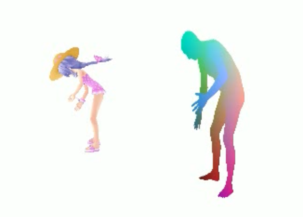
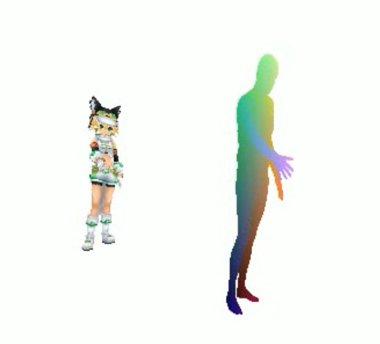
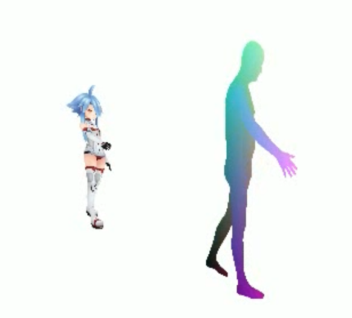
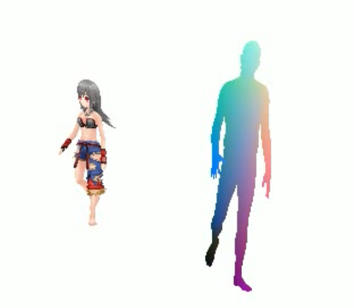
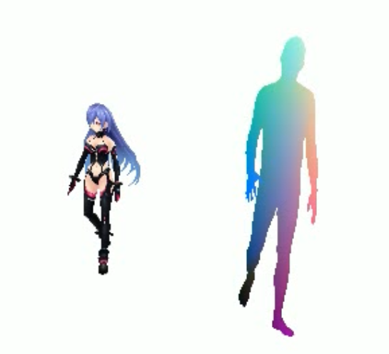

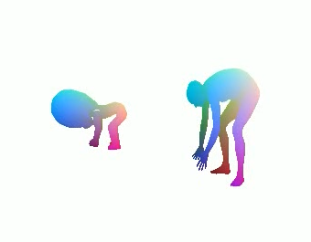
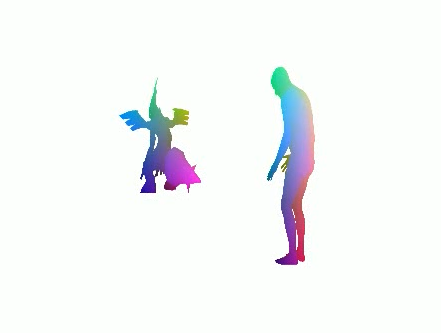
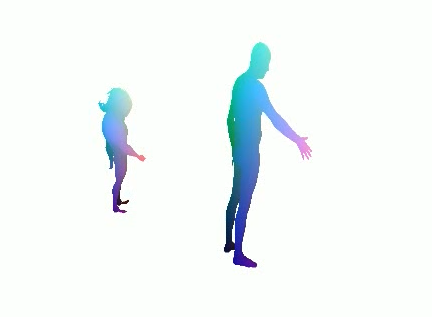
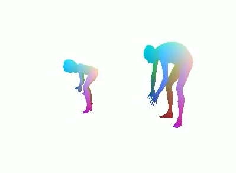
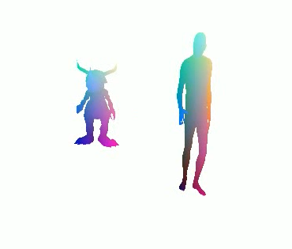
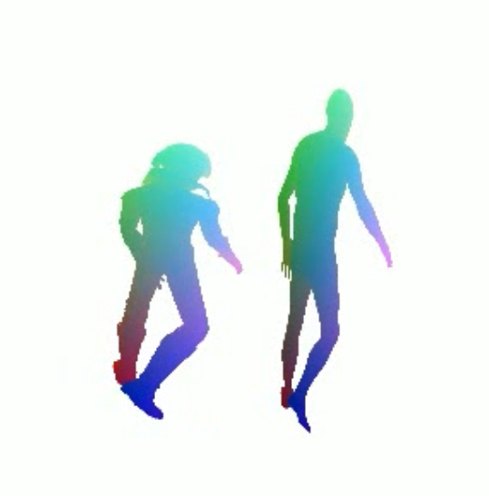

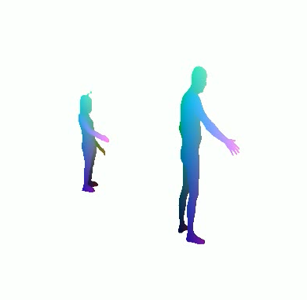
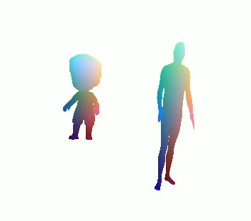

# 协议 
本项目在 Apache-2.0 协议下开源

所涉及代码及数据的最终解释权归倪冰冰老师课题组所有

Group 9
