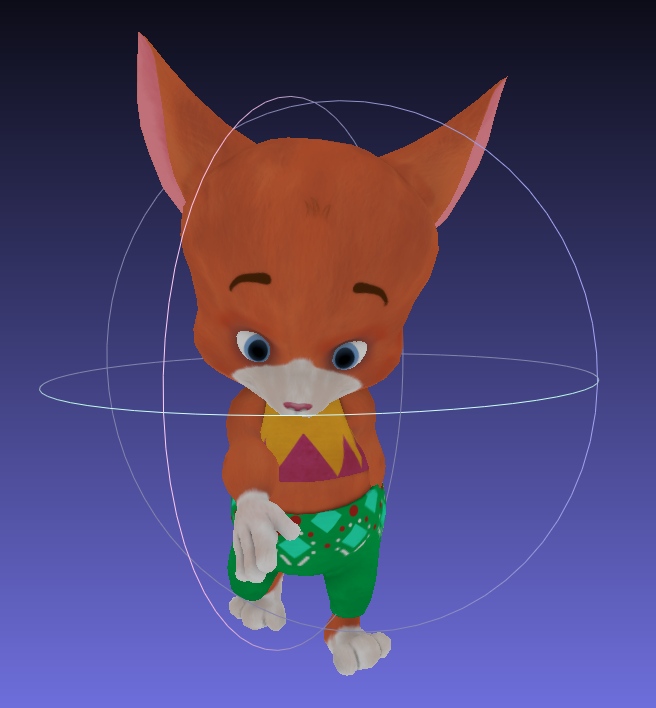

### Step1 Environment Preparation 
*It is more recommeneded to use linux to configure your maya and mayapy*

* Install maya. For linux, refer to [autodesk tutorial](https://knowledge.autodesk.com/zh-hans/support/maya/learn-explore/caas/simplecontent/content/installing-maya-2020-ubuntu.html)
* When maya is installed successfully, you can find *mayapy* at `/usr/autodesk/maya/bin/maypy`, you can use absolute path / alias / env variable to let your system find mayapy
* To test mayapy, you can try to run all the `import` commands in `maya_save_fbx.py`

### Step2 Dataset / 3D Model Preparation 
Download fbx model from the internet, you can use the links 
* [mixamo](https://www.mixamo.com/#/) (recommended)
* [cgtrader](https://www.cgtrader.com/free-3d-models/human)
* [turbosquid](https://www.turbosquid.com/Search/3D-Models/free/human/fbx)

You need to ensure the downloaded fbx model is T-posed by default 

### Step3 Run the fbx parser
Run in the terminal 
`mayapy fbx_parser.py sample.fbx`

If the parsing is successful, you will see generated files like follows: 
- sample.txt -> riginfo 
- smaple.obj -> T-posed mesh
- sample.fbm -> texture information 

You may see some error / warning info in the console's logging, but you can ignore them if expected files are all genereated. 

### Example 
For the matching of 3d model with texture, an example is shown as follows: 



We offer detailed instructions to help you dive into this project
```
# clone this repo 
git clone https://github.com/yuzhenbo/pose2carton
cd /path/to/pose2carton

# copy smpl pose info from class material 
cp /path/to/classmt/pose_sample.pkl ./ (#ln -s /path/to/classmt/pose_sample.pkl pose_sample.pkl)
python transfer.py
```
The results will be saved to `samples/`, you can `cd samples/` and use meshlab to view the results. The generated mesh may have self-collision/intersection, here we simply ignore such case since 
we only copy rotation vectors here. To avoid such problems, you can refer to a topic `motion retargetting`

### Others
* For fbx downloaded from the internet, parsed riginfo(.txt) may contain illegal characters for mayapy to parse. In such cases, you need to clean the `txt` manually
For example, for models downloaded from mixamo, remove `mixamo::` in the riginfo file. 
* You may find triangles of the mesh in `obj` does not cover the whole surface of the 3d model, and in such cases, you can manually add triangles, e.g. utilizing `open3d`

**If you encounter any problem, feel free to contact TA**
